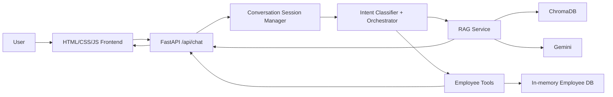

# Architecture

## RAG-only
Question -> classifier -> `search_company_documents` -> query embedding -> Chroma cosine retrieval -> threshold/context -> Gemini -> answer + metadata-derived sources.

## Employee tool
Question -> classifier -> `get_employee_info` -> mock DB -> answer with no document sources.

## Multi-tool
Policy + balance request -> policy sub-query goes to RAG; employee ID goes to `get_employee_info`; orchestrator combines both results and reports both tools.

## Leave action
Explicit apply request -> extract employee/dates/reason -> validate employee -> `apply_leave` -> inclusive day calculation -> atomic in-memory balance/record commit -> response.

## Follow-up
Frontend reuses `conversation_id`. Session manager binds it to the employee and stores bounded history. Follow-up intent may use history to resolve context, but mutable leave balance is read again from the employee tool, preventing stale state and action replay.
